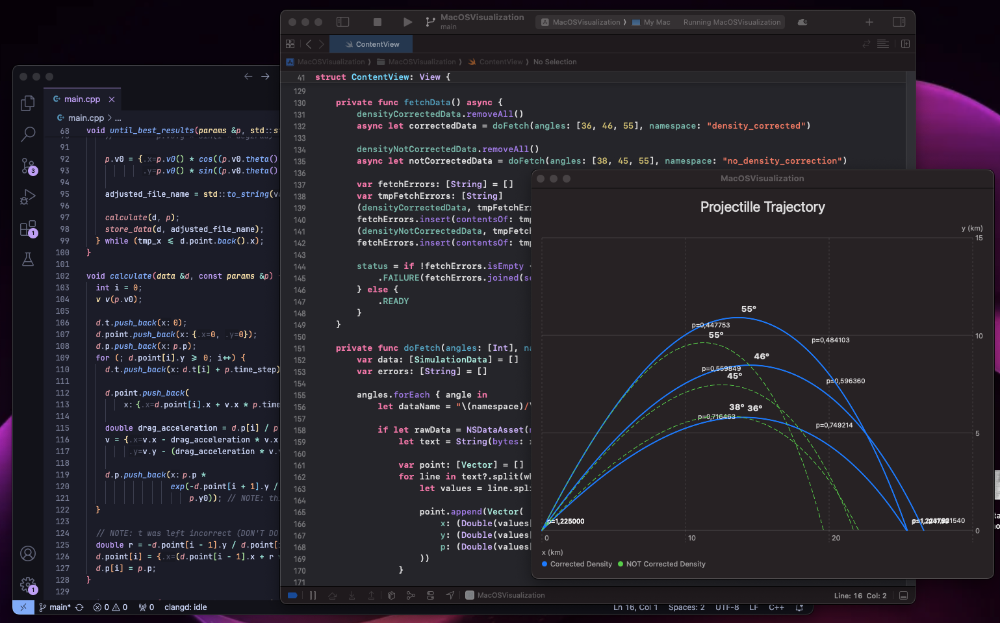

# Cannon Shell Simluation

This is a realistic model of a projectile trajectory considering the air resistance and its density changings along the way; for visualization I made a macOS app.

I also implemented a “launch angle optimizer” that runs it for different angles and it’s nice to see how the range increases when we take advantage of higher altitude air density reduction 😄

It is also great to think about all of the many other possible aspects we could consider here; we are talking about air temperature, weather field and even earth rotation, to mention some.
